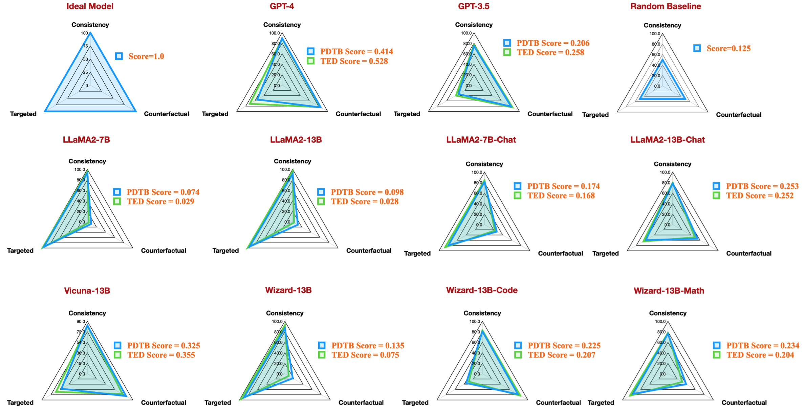

# Official Implementation for Discursive Socratic Questioning (DiSQ) 

Official implementation for our paper: Discursive Socratic Questioning: Evaluating the Faithfulness of Language Models’ Understanding of Discourse Relations (2024) Yisong Miao , Hongfu Liu, Wenqiang Lei, Nancy F. Chen, Min-Yen Kan. ACL 2024. \
Paper PDF: [https://yisong.me/publications/acl24-DiSQ-CR.pdf](https://yisong.me/publications/acl24-DiSQ-CR.pdf) \
Slides: [https://yisong.me/publications/acl24-DiSQ-Slides.pdf](https://yisong.me/publications/acl24-DiSQ-Slides.pdf) \
Poster: [https://yisong.me/publications/acl24-DiSQ-Poster.pdf](https://yisong.me/publications/acl24-DiSQ-Poster.pdf)

# Installation 📀💻

```
git clone git@github.com:YisongMiao/DiSQ-Score.git
conda activate
cd DiSQ-Score
cd scripts
pip install -r requirements.txt
```

# Evaluate one model with one line command 🏃🧪🔬
Would you like to know the DiSQ Score for any language model? You are welcome to use this one line command!

We provide a simplified command to evaluate any language model (LM) that has been hosted in the [HuggingFace model hub](https://huggingface.co/models).
You are recommended to use this for any new model (especially those not studied in our paper). 

```
bash scripts/one_model.sh <modelurl>
```

The <`modelurl`> variable specifies the shortened path in the huggingface hub, for example, 

```
bash scripts/one_model.sh meta-llama/Meta-Llama-3-8B
```

## Specify Your Path 🏎️🛣️
Before running the bash files, please edit the bash file to specify your path to your local HuggingFace Cache. \
For example, in [scripts/unsupervised.sh](https://github.com/WING-NUS/ELCo/blob/main/scripts/unsupervised.sh):
```
#!/bin/bash

# Please define your own path here
huggingface_path=YOUR_PATH
```
you may change `YOUR_PATH` to the absolute directory location of your Huggingface Cache (e.g. `/disk1/yisong/hf-cache`).\
We recommend at least 200GB free space. 

An output text file will be saved at `data/results/verbalizations/Meta-Llama-3-8B.txt`, which contains:

```
=== The results for model: Meta-Llama-3-8B ===
Dataset: pdtb
DiSQ Score: 0.206
Targeted Score: 0.345
Counterfactual Score: 0.722
Consistency: 0.827
DiSQ Score for Comparison.Concession: 0.188
DiSQ Score for Comparison.Contrast: 0.22
DiSQ Score for Contingency.Reason: 0.164
DiSQ Score for Contingency.Result: 0.177
DiSQ Score for Expansion.Conjunction: 0.261
DiSQ Score for Expansion.Equivalence: 0.221
DiSQ Score for Expansion.Instantiation: 0.191
DiSQ Score for Expansion.Level-of-detail: 0.195
DiSQ Score for Expansion.Substitution: 0.151
DiSQ Score for Temporal.Asynchronous: 0.312
DiSQ Score for Temporal.Synchronous: 0.084
=== End of the results for model: Meta-Llama-3-8B ===
=== The results for model: Meta-Llama-3-8B ===
Dataset: ted
DiSQ Score: 0.233
Targeted Score: 0.605
Counterfactual Score: 0.489
Consistency: 0.787
DiSQ Score for Comparison.Concession: 0.237
DiSQ Score for Comparison.Contrast: 0.268
DiSQ Score for Contingency.Reason: 0.136
DiSQ Score for Contingency.Result: 0.211
DiSQ Score for Expansion.Conjunction: 0.268
DiSQ Score for Expansion.Equivalence: 0.205
DiSQ Score for Expansion.Instantiation: 0.194
DiSQ Score for Expansion.Level-of-detail: 0.222
DiSQ Score for Expansion.Substitution: 0.176
DiSQ Score for Temporal.Asynchronous: 0.156
DiSQ Score for Temporal.Synchronous: 0.164
=== End of the results for model: Meta-Llama-3-8B ===
```

# Step by step walk through 🚶🧪🔬

## Preliminary: Dataset 📀💿💽

We store our datasets in JSON files located at `data/datasets/dataset_pdtb.json` and `data/datasets/dataset_ted.json`. For example, let's take one instance from the PDTB dataset:

```
"2": {
        "Didx": 2,
        "arg1": "and special consultants are springing up to exploit the new tool",
        "arg2": "Blair Entertainment, has just formed a subsidiary -- 900 Blair -- to apply the technology to television",
        "DR": "Expansion.Instantiation.Arg2-as-instance",
        "Conn": "for instance",
        "events": [
            [
                "special consultants springing",
                "Blair Entertainment formed a subsidiary -- 900 Blair -- to apply the technology to television"
            ],
            [
                "special consultants exploit the new tool",
                "Blair Entertainment formed a subsidiary -- 900 Blair -- to apply the technology to television"
            ]
        ],
        "context": "Other long-distance carriers have also begun marketing enhanced 900 service, and special consultants are springing up to exploit the new tool. Blair Entertainment, a New York firm that advises TV stations and sells ads for them, has just formed a subsidiary -- 900 Blair -- to apply the technology to television.  "
    },
```

Here are the fields in this dictionary entry:
- `Didx`: The discourse ID.
- `arg1` and `arg2`: The two arguments.
- `DR`: The discourse relation.
- `Conn`: The discourse connective.
- `events`: A list of pairs, storing the event pairs predicted as salient signals.
- `context`: The discourse context.


## Step 1 Question Generation 🙋🧑‍🏫

```
cd DiSQ-Score
bash scripts/question_generation.sh
```

This bash file will call `question_generation.py` to generate questions under different configurations. 


The arguments for `question_generation.py` are as follows:

- `--dataset`: Specifies the dataset, either `pdtb` or `ted`.
- `--modelname`: Aliases for models have been created. `13b` refers to LLaMA2-13B, `13bchat` to LLaMA2-13B-Chat, and `vicuna-13b` to Vicuna-13B. The specific URLs for these models can be found in `disq_config.py`.
- `--version`: Specifies which version of the prompt templates to use, with options `v1`, `v2`, `v3`, and `v4`.
- `--paraphrase`: Replaces the standard questions with their paraphrased versions, with options `p1` and `p2`. Unlike the standard ones that call `qa_utils.py`, the paraphrased functions call `qa_utils_p1.py` and `qa_utils_p2.py`, respectively.
- `--feature`: Specifies which linguistic features to use for the discussion questions. Linguistic features include `conn` (discourse connective), and `context` (discourse context). Historical QA data requires a seperate script. 

The output will be stored at, for example, `data/questions/dataset_pdtb_prompt_v1.json` under the configuration `dataset==pdtb` and `version==v1`.

We ask our users to generate the questions themselves because this approach is automatic and helps save space in our GitHub repository (which could add up to \~200 MB). If you are unable to run the bash file, please contact us for the question files.


## Step 2 Question Answering 💭💬

```
cd DiSQ-Score
bash scripts/question_answering.sh
```

This bash file will call `question_answering.py` to perform Discursive Socratic Questioning (DiSQ) for any given model. `question_answering.py` takes all the arguments from `question_generation.py`, plus the following new arguments:

- `--modelurl`: Specifies the URL for any new models not currently in the config file. For example, 'meta-llama/Meta-Llama-3-8B' specifies the LLaMA3-8B model and will overwrite the `modelname` argument.
- `--hf-path`: Specifies the path to store the large model parameters. At least 200 GB of free disk space is recommended.
- `--device_number`: Specifies the ID of the GPU to use.

The output will be stored at, for example, `data/results/13bchat_dataset_pdtb_prompt_v1/`. The prediction for each question is a list of tokens and their probabilities, stored in a pickle file within the folder.

**Caveat:** The Wizard model has been taken down by the developers. We advise users not to try these models. Check the discussion thread at: [https://huggingface.co/posts/WizardLM/329547800484476](https://huggingface.co/posts/WizardLM/329547800484476).


## Step 3 Evaluation and Scoring ☑️💯

```
cd DiSQ-Score
bash scripts/eval.sh
```

This bash file will call `eval.py` to evaluate the previously obtained model predictions.

`eval.py` takes the same set of parameters as `question_answering.py`.

The outcome of the evaluation will be stored in `disq_score_pdtb.csv` if the specified dataset is PDTB.

There are 20 columns in the CSV file, namely:

- `taskcode`: Indicates the configuration being tested, e.g., `dataset_pdtb_prompt_v1_13bchat`.
- `modelname`: Specifies which language model is being tested.
- `version`: Indicates the version of the prompt.
- `paraphrase`: The parameter for paraphrase.
- `feature`: Specifies which feature has been used.
- `Overall`: The overall DiSQ Score.
- `Targeted`: Targeted score, one of the three components in the DiSQ Score.
- `Counterfactual`: Counterfactual score, one of the three components in the DiSQ Score.
- `Consistency`: Consistency score, one of the three components in the DiSQ Score.
- `Comparison.Concession`: The DiSQ Score for this specific discourse relation.
- ... (other discourse relations)

Note that we choose the best results among versions v1 to v4 to marginalize the impact of prompt templates.

To do so, `eval.py` automatically extracts the best results:

| taskcode | modelname | version | paraphrase | feature | Overall | Targeted | Counterfactual | Consistency | Comparison.Concession | Comparison.Contrast | Contingency.Reason | Contingency.Result | Expansion.Conjunction | Expansion.Equivalence | Expansion.Instantiation | Expansion.Level-of-detail | Expansion.Substitution | Temporal.Asynchronous | Temporal.Synchronous |
|---|---|---|---|---|---|---|---|---|---|---|---|---|---|---|---|---|---|---|---|
| dataset_pdtb_prompt_v4_7b | 7b | v4 |  |  | 0.074 | 0.956 | 0.084 | 0.929 | 0.03 | 0.083 | 0.095 | 0.095 | 0.077 | 0.054 | 0.086 | 0.068 | 0.155 | 0.036 | 0.047 |
| dataset_pdtb_prompt_v1_7bchat | 7bchat | v1 |  |  | 0.174 | 0.794 | 0.271 | 0.811 | 0.231 | 0.435 | 0.132 | 0.173 | 0.214 | 0.105 | 0.121 | 0.15 | 0.199 | 0.107 | 0.04 |
| dataset_pdtb_prompt_v2_13b | 13b | v2 |  |  | 0.097 | 0.945 | 0.112 | 0.912 | 0.037 | 0.099 | 0.081 | 0.094 | 0.126 | 0.101 | 0.113 | 0.107 | 0.077 | 0.083 | 0.093 |
| dataset_pdtb_prompt_v1_13bchat | 13bchat | v1 |  |  | 0.253 | 0.592 | 0.545 | 0.785 | 0.195 | 0.485 | 0.129 | 0.173 | 0.289 | 0.155 | 0.326 | 0.373 | 0.285 | 0.194 | 0.028 |
| dataset_pdtb_prompt_v2_vicuna-13b | vicuna-13b | v2 |  |  | 0.325 | 0.512 | 0.766 | 0.829 | 0.087 | 0.515 | 0.201 | 0.352 | 0.369 | 0.0 | 0.334 | 0.46 | 0.199 | 0.511 | 0.074 |


For example, this table shows the best result for PDTB datasets for available open-source models, which reproduce the radar figure in our paper:



## Discussion Experiments 🔬🤔

We also provide instructions for evaluating discussion questions about linguistic features:

- To evaluate discourse connectives and discourse context, specify `--feature` as `conn` and `context` in `question_generation.py` (Step 1) and re-run all experiments.
- To evaluate historical QA data, run `question_generation_history.py`. This script will extract answers from the stored QA results and generate new questions.

# Environment 🧪

## Legacy environment 🏕️🏕️

For most NLPers, probably you will be able to run our code with your existing virtual (conda) environments.

When we performed our experiments, the package versions were as followed:
```
torch==2.0.1
transformers==4.30.0
sentencepiece
protobuf
scikit-learn
pandas
```

## Modern environment 🆕🏕️🏕️
However, we have observed that newer models require upgraded package versions:
```
torch==2.4.0
transformers==4.43.3
sentencepiece
protobuf
scikit-learn
pandas
```


# Citations 📜📝
If you find our work interesting, you are most welcome to try our dataset/codebase. \
Please kindly cite our research if you have used our dataset/codebase:

```
@inproceedings{acl24discursive,
  title={Discursive Socratic Questioning: Evaluating the Faithfulness of Language Models' Understanding of Discourse Relations},
  author={Yisong Miao , Hongfu Liu, Wenqiang Lei, Nancy F. Chen, and Min-Yen Kan},
  booktitle={Proceedings of the Annual Meeting fof the Association of Computational Linguistics},
  month={August},
  year={2024},
  organization={ACL},
  address = "Bangkok, Thailand",
}
```


## Contact 📤📥
If you have questions or bug reports, please raise an issue or contact us directly via the email:\
Email address: 🐿@🐰\
where 🐿️=`yisong`, 🐰=`comp.nus.edu.sg`

## Licence 🪪🪪

CC By 4.0
